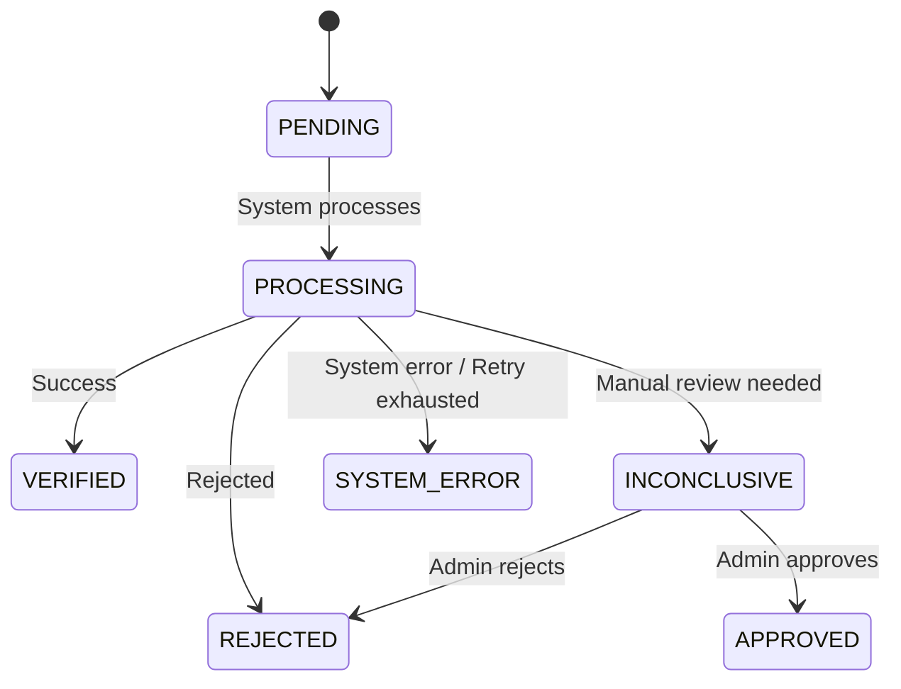

## 1. Can sellers create products while their identity verification is pending?

#### Design A: Must complete verification before creating products

- **Pros:** Maximum safety. No low-quality products on the marketplace. Simpler DB.
- **Cons:** Very poor UX. Sellers must wait in queue with nothing to do.

#### Design B: Allow creating products first, hidden until approved

- **Pros:** Optimized onboarding conversion. Sellers can set up their store immediately.
- **Cons:** More complex product status management and permissions (new products default to hidden/draft state).

> **Choose Design B.** With pressure of 5,000 sellers in the first week and a rate limit of 100 requests/minute, forcing sellers to wait with no action will destroy UX. Trading additional management complexity and a slightly larger DB is worth it for better user experience.

---

## 2. Launch Week (Operating Under High Load & Resource Constraints)

### Operational Constraints

- **Load:** ~5,000 seller registrations in the first week.
- **Resource limits:** $2 USD per request, max rate limit 100 requests/minute.

### System Handling Strategy

1. **Receive File & Respond Immediately:** Seller uploads documents -> Save to DB with `PENDING` status -> Return success immediately so seller can continue.
2. **Enqueue to Queue:** Push verification info to Message Queue (e.g., BullMQ).
3. **Rate-limited Worker:** Worker silently pulls jobs from Queue and sends to third party at a safe rate (~80 requests/minute) to avoid exceeding rate limit.
4. **Pre-validation:** Backend validates file format and size before sending. Error records are `REJECTED` locally, saving $2 USD per garbage request.

### Trade-offs

- **Prioritize system & budget protection:** Accept queue buildup during peak times (sellers wait longer), ensuring the system doesn't crash and avoiding penalty fees from exceeding API rate limits.
- **Remove real-time processing:** Don't call API directly on upload to avoid overload when 5,000 sellers simultaneously operate.

> **Least confident point:** Seller patience while waiting. If dropout rate is high, the system will be upgraded with Priority Queue or additional provider integration.

---

## 3. State Machine (Verification Lifecycle)

### Terminal State Guard

> [!CAUTION]
> **Common careless programmer mistake:** Using loose conditions (e.g., only finding record by `id` to update status without checking current status in DB, or only checking `WHERE status = 'PROCESSING'`).
> *Consequence of this mistake:* When a Webhook reports `INCONCLUSIVE` (needs manual review) and admin processes it changing status to `APPROVED` (terminal state). Immediately after, a delayed Webhook reporting `REJECTED` arrives late due to network congestion. If the engineer carelessly runs `UPDATE` based on record ID without protecting terminal states, this late Webhook will overwrite the admin's `APPROVED` status with `REJECTED`, breaking system consistency.
>
> **Protection solution:** Terminal states (`VERIFIED`, `APPROVED`, `REJECTED`, `SYSTEM_ERROR`) are **immutable**. Block direct overwrites in the DB update statement:
> `UPDATE verifications SET status = :new_status WHERE id = :id AND status NOT IN ('VERIFIED', 'APPROVED', 'REJECTED', 'SYSTEM_ERROR')`

---

## 4. What You Deliberately Did Not Build (Intentionally Omitted for V1)

**Omitted feature:** Re-upload/resubmission flow when rejected (`REJECTED`) or system error (`SYSTEM_ERROR`).

- **Reason:** Save UI development time and avoid complex state transition control. Each seller has only 1 verification request record in the system, completely eliminating race condition risk when users intentionally or accidentally resubmit documents while Worker/Webhook is still processing.
- **Risk:** When a seller enters wrong information or uploads a broken image leading to `REJECTED` status, they are permanently stuck and cannot re-initiate verification on the UI.

---

## 5. The Failure That Worries You Most (Most Feared Production Failure)

**Most feared failure:** **Lost webhook responses from third party (due to network outage or system failure).**
Consequence: Seller records get stuck in `PROCESSING` status indefinitely.

### Mitigation Strategy

1. **Reconciliation (Automatic reconciliation):** Run Cron job scanning database every 10 minutes to find records in `PROCESSING` status.
2. **State Pulling (Active querying):** Call third-party `GET /verifications/{id}` API to compare and update latest status to DB.
3. **Retry with Exponential Backoff:** Two retry mechanisms:
   - **BullMQ Worker:** Exponential backoff with 60s base (60s→120s→240s→480s→960s), max 5 attempts. Retries for connection errors when sending jobs to third party.
   - **Reconciliation Cron:** Retry on next cron cycle (10 minutes). No separate exponential backoff — each cron cycle is one "attempt" and the system keeps going until a response arrives or transitions to SYSTEM_ERROR.
4. **Exhausted Handling:** When BullMQ worker exhausts all retry attempts (5 times), transition record to `SYSTEM_ERROR` status, log details for on-call engineers to manually investigate.