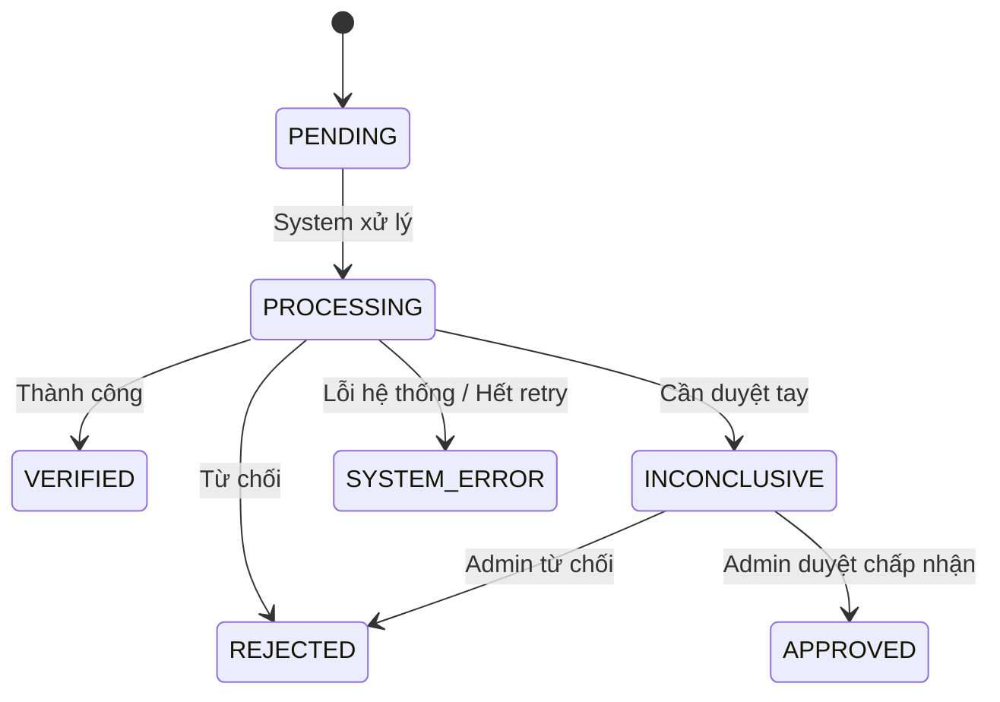

## 1. Người bán (Seller) có được phép tạo sản phẩm trong khi chờ xác thực danh tính không?

#### Thiết kế A: Bắt buộc xác thực xong mới được tạo sản phẩm

- **Ưu điểm:** Đảm bảo an toàn tuyệt đối. Không sợ hàng kém chất lượng lọt vào sàn. DB đơn giản.
- **Nhược điểm:** Trải nghiệm người dùng (UX) rất kém. Seller phải xếp hàng chờ đợi mà không thao tác được gì.

#### Thiết kế B: Cho phép tạo sản phẩm trước, ẩn hiển thị cho đến khi được duyệt

- **Ưu điểm:** Tối ưu hóa tỷ lệ chuyển đổi (onboarding conversion). Seller có thể setup gian hàng ngay.
- **Nhược điểm:** Phân quyền và quản lý trạng thái sản phẩm phức tạp hơn (sản phẩm tạo mới mặc định ẩn hoặc ở trạng thái nháp).

> **Chọn thiết kế B**. Với áp lực 5.000 seller tuần đầu và giới hạn xác thực 100 requests/phút, bắt seller xếp hàng chờ không làm gì sẽ phá hỏng trải nghiệm UX. Đánh đổi thêm phân quyền quản lí và db bị phình hơn để tối ưu trải nghiệm người dùng.

---

## 2. Launch Week (Vận hành dưới tải trọng cao & Giới hạn tài nguyên)

### Ràng buộc vận hành

- **Tải trọng:** ~5.000 seller đăng ký tuần đầu.
- **Giới hạn tài nguyên:** Chi phí 2 USD/request, giới hạn tốc độ tối đa 100 requests/phút.

### Giải pháp xử lý của hệ thống

1. **Nhận File & Phản hồi ngay:** Seller upload tài liệu -> Lưu DB với trạng thái `PENDING` -> Trả kết quả thành công lập tức để seller tiếp tục thao tác.
2. **Đưa vào hàng đợi (Queue):** Đẩy thông tin xác thực vào Message Queue (ví dụ: BullMQ).
3. **Worker kiểm soát tốc độ:** Worker ngầm lấy job từ Queue gửi sang bên thứ ba với tốc độ an toàn (~80 requests/phút) để tránh vượt rate limit.
4. **Lọc trước lỗi (Pre-validation):** Backend tự kiểm tra định dạng và dung lượng file trước khi gửi đi. Bản ghi lỗi sẽ bị `REJECTED` ngay tại local, giúp tiết kiệm chi phí 2 USD cho mỗi request rác.

### Các đánh đổi

- **Chọn bảo vệ hệ thống & ngân sách:** Chấp nhận hàng đợi bị dồn ứ lúc cao điểm (seller chờ lâu hơn), đảm bảo hệ thống không sập và không mất phí phạt do gọi API quá giới hạn.
- **Loại bỏ xử lý thời gian thực (Real-time):** Không gọi API trực tiếp ngay khi upload để tránh quá tải khi 5.000 seller đồng thời thao tác.

> **Điểm ít tự tin nhất:** Sự kiên nhẫn của seller khi chờ đợi. Nếu tỷ lệ rời bỏ cao, hệ thống sẽ nâng cấp thêm hàng đợi ưu tiên (Priority Queue) hoặc tích hợp nhà cung cấp phụ.

---

## 3. State Machine (Vòng đời trạng thái)

### Bảo vệ trạng thái kết thúc (Terminal State Guard)

> [!CAUTION]
> **Lỗi lập trình viên dễ làm sai:** Cho phép cập nhật ghi đè trạng thái kết thúc khi Webhook gửi về sai thứ tự (Out-of-order Webhook).
> _Ví dụ:_ Webhook thông báo kết quả `INCONCLUSIVE` (đã được admin xem xét và duyệt thành `APPROVED`) bị ghi đè ngược bởi một Webhook thông báo kết quả `REJECTED` cũ đến muộn.
>
> **Giải pháp bảo vệ:** Trạng thái kết thúc (`VERIFIED`, `APPROVED`, `REJECTED`, `SYSTEM_ERROR`) là **bất biến (Immutable)**. Chặn ghi đè trực tiếp ở câu lệnh cập nhật DB:
> `UPDATE verifications SET status = :new_status WHERE id = :id AND status NOT IN ('VERIFIED', 'APPROVED', 'REJECTED', 'SYSTEM_ERROR')`

---

## 4. What you deliberately did not build (Cố ý lược bỏ cho V1)

**Tính năng lược bỏ:** Tích hợp Cloud Storage thực tế (AWS S3) và hệ thống phân quyền phức tạp (OAuth).

- **Lý do:** Tiết kiệm thời gian cấu hình hạ tầng Cloud để tập trung hoàn thiện các tính năng cốt lõi (Hàng đợi, Worker, Giao diện Admin) trong 4-5 tiếng làm bài. Dữ liệu file được lưu tạm thời dưới dạng Base64 trong DB hoặc ghi đĩa cục bộ.
- **Rủi ro:** Mất dữ liệu nếu server bị khởi động lại, phình to dung lượng database do dữ liệu Base64.
- **Giảm thiểu rủi ro:** Giới hạn kích thước file upload dưới 2MB và ghi logs vết lưu trữ rõ ràng để phục vụ debug.

---

## 5. The failure that worries you most (Lỗi lo sợ nhất trong Production)

**Lỗi đáng sợ nhất:** **Mất Webhook phản hồi từ bên thứ ba (do sập mạng hoặc lỗi hệ thống).**
Hậu quả: Hồ sơ của seller bị kẹt ở trạng thái `PROCESSING` vô thời hạn.

### Giải pháp giảm thiểu (Mitigation Strategy)

1. **Reconciliation (Đối soát tự động):** Chạy Cron job quét database mỗi 10 phút để tìm các bản ghi ở trạng thái `PROCESSING`.
2. **State Pulling (Chủ động truy vấn):** Gọi API `GET /verifications/{id}` của bên thứ ba để đối chiếu và cập nhật trạng thái mới nhất về DB.
3. **Retry với Exponential Backoff & Jitter:** Khi API đối soát lỗi, thử lại theo chu kỳ tăng dần (ví dụ: nhân tố 2 tăng dần kèm theo độ trễ ngẫu nhiên - Jitter để tránh nghẽn tải hệ thống).
4. **Xử lý khi cạn kiệt (Exhausted):** Khi cạn kiệt số lần thử lại tại Worker hoặc gặp lỗi hệ thống nghiêm trọng, chuyển bản ghi sang trạng thái `SYSTEM_ERROR`, ghi log chi tiết và bắn Paging Alert (Slack/Telegram) để kỹ sư trực hệ thống kiểm tra thủ công.
