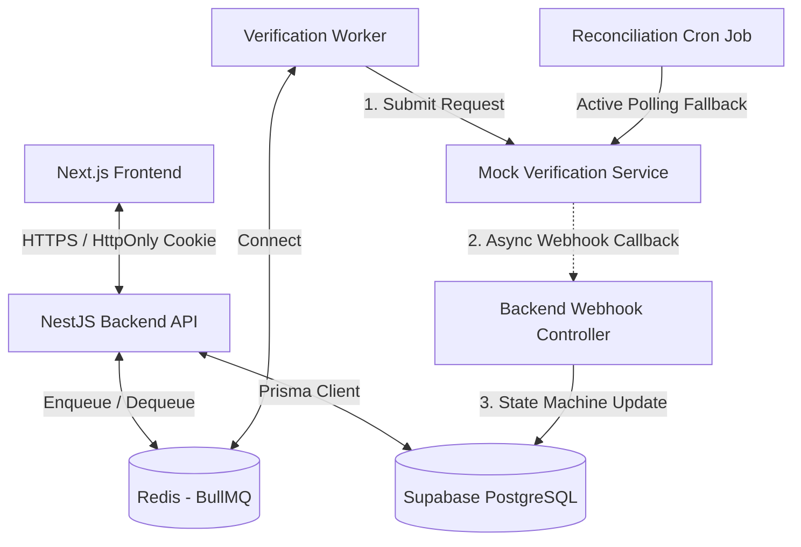

# Kivy Seller Verification Platform

Hệ thống quản lý và xác thực danh tính người bán (Seller Identity Verification Pipeline) được xây dựng bằng NestJS, Prisma, và Supabase (PostgreSQL). Hệ thống tích hợp Message Queue (BullMQ) để kiểm soát rate limit và xử lý tải cao trong quá trình onboarding.

---

## 🏗️ Kiến trúc hệ thống (System Architecture)

Dưới đây là sơ đồ vận hành bất đồng bộ của ứng dụng:



- **Next.js Frontend:** UI giao diện người dùng (Seller Dashboard / Admin Console).
- **NestJS Backend:** Đóng vai trò làm API Gateway và xử lý toàn bộ logic nghiệp vụ.
- **Redis & BullMQ:** Message Queue kiểm soát tần suất (Rate limit) gửi tài liệu sang dịch vụ bên ngoài.
- **Verification Worker:** Lắng nghe hàng đợi để gửi yêu cầu xác thực sang dịch vụ Mock.
- **Mock Verification Service:** Chạy độc lập, giả lập quá trình xác thực và trả kết quả bất đồng bộ.
- **Reconciliation Cron:** Cơ chế đối soát chủ động đề phòng mất gói tin webhook.

---

## 🌐 Đường dẫn ứng dụng đã Deploy (Production URLs)

- **Frontend Web App:** [https://kivy-homework.vercel.app/](https://kivy-homework.vercel.app/)
- **Backend REST API:** [https://kivy-backend.onrender.com](https://kivy-backend.onrender.com) (Tài liệu Swagger API: [https://kivy-backend.onrender.com/docs](https://kivy-backend.onrender.com/docs))
- **Mock Verification Service:** [https://kivy-mock-service.onrender.com/](https://kivy-mock-service.onrender.com/)

---

## 🔐 Tài khoản chạy thử (Seeded Credentials)

Cơ sở dữ liệu đã được seed sẵn các tài khoản thử nghiệm sau để phục vụ quá trình chấm điểm:

| Vai trò    | Email             | Mật khẩu         | Chức năng kiểm thử                                             |
| :--------- | :---------------- | :--------------- | :------------------------------------------------------------- |
| **Seller** | `seller@kivy.com` | `sellerpassword` | Upload tài liệu xác thực, xem trạng thái, quản lý sản phẩm.    |
| **Admin**  | `admin@kivy.com`  | `adminpassword`  | Xem danh sách hồ sơ xác thực, kiểm duyệt hồ sơ `INCONCLUSIVE`. |

> [!TIP]
> **Đăng nhập nhanh (Auto-fill):** Màn hình đăng nhập của cả Admin và Seller đều tích hợp sẵn tính năng **"Click to auto-fill"** ở ngay dưới form. Bạn chỉ cần click vào hộp thông tin demo, hệ thống sẽ tự động điền tài khoản mà không cần nhập thủ công.

---

## 📊 Phạm vi hoàn thành (What's Built & What's Partial)

### ✅ Những tính năng đã hoàn thành (What Works)

1. **Xác thực và phân quyền:** Sử dụng JWT được lưu trữ an toàn trong **HttpOnly cookie**, phân chia quyền rõ ràng giữa Admin và Seller.
2. **Seller Pipeline:** Tải lên tài liệu dạng Base64, tự động đưa vào hàng đợi kiểm duyệt, tạo và hiển thị danh sách sản phẩm.
3. **Hàng đợi kiểm soát Rate Limit:** Tích hợp **BullMQ + Redis** để đảm bảo tốc độ gửi yêu cầu sang bên thứ ba không vượt quá giới hạn (Worker chạy ổn định ở mức ~80 req/phút).
4. **State Machine:** Triển khai State Machine kiểm soát chặt chẽ quy trình chuyển đổi trạng thái (`PENDING` -> `PROCESSING` -> `VERIFIED` / `REJECTED` / `INCONCLUSIVE` -> `APPROVED` / `REJECTED`). Có cơ chế khóa bi quan (Row Locking) chống Race Condition khi webhook đến trùng lặp.
5. **Reconciliation (Đối soát tự động):** Cron job quét định kỳ mỗi 10 phút, chủ động truy vấn API bên thứ ba cho những hồ sơ bị kẹt ở trạng thái `PROCESSING`.
6. **Admin Dashboard:** Giao diện Next.js hiển thị biểu đồ chỉ số (Metrics), bảng danh sách hồ sơ lọc theo trạng thái, ngăn xem tài liệu trực quan, timeline ghi lại lịch sử sự kiện và hành động duyệt hồ sơ.
7. **Mock Service:** Một dịch vụ Hono độc lập giả lập API bên thứ ba với các cơ chế rate limit (100 req/min), trả kết quả bất đồng bộ qua Webhook hoặc cho phép polling đối soát.

### ⚠️ Những phần cố ý lược bỏ / Đơn giản hóa (Deliberately Cut / Partial)

1. **AWS S3 Storage:** Để tối ưu hóa thời gian thực hiện, tài liệu của seller hiện được lưu trữ trực tiếp dưới dạng Base64 trong database local hoặc ghi đĩa cục bộ thay vì đẩy lên dịch vụ S3 cloud thực tế.
2. **Thông báo thời gian thực (Real-time WebSockets):** Trạng thái xác thực ở frontend hiện được cập nhật thông qua cơ chế Refresh/Polling đơn giản thay vì WebSocket hoặc Server-Sent Events (SSE).

---

## 🚀 Hướng dẫn khởi chạy nhanh ở Local (Quick Start)

Dự án gồm **3 thành phần** cần khởi chạy theo thứ tự: Database → Mock Service → Backend → Frontend.

### Yêu cầu hệ thống (Prerequisites)

- **Node.js** v20 trở lên
- **pnpm** v9+ (hoặc npm/yarn)
- **Docker** và Docker Compose (để khởi chạy Supabase local)
- **Redis** (đã được cấu hình sẵn trong `REDIS_URL`ở `.env`)

---

### Bước 1: Khởi tạo Database (Supabase Local)

```bash
cd backend
pnpm install
pnpm run db:setup
```

Lệnh này sẽ:

- Khởi động Docker Supabase local
- Tự động chạy `prisma migrate dev` để tạo bảng
- Sinh Prisma Client

> **Lưu ý:** File `.env` đã có sẵn với `DATABASE_URL` trỏ về Supabase local. Nếu chưa có, copy từ `.env.example`.

---

### Bước 2: Khởi động Mock Service

```bash
# Mở terminal mới
cd mock-service
pnpm install
pnpm run dev
```

- Mock Service chạy trên **port 3001**
- Giả lập API bên thứ 3 với rate limit 100 req/min
- Trả kết quả verification qua Webhook hoặc polling

---

### Bước 3: Khởi động Backend (NestJS)

```bash
# Mở terminal mới
cd backend
pnpm run start:dev
```

- Backend chạy trên **port 5000**
- Tự động kết nối Redis qua `REDIS_URL` trong `.env`
- BullMQ worker xử lý verification queue

---

### Bước 4: Khởi động Frontend (Next.js)

```bash
# Mở terminal mới
cd frontend
pnpm install
pnpm run dev
```

- Frontend chạy trên **port 3000**
- Kết nối backend tại `http://localhost:5000`

---

### ✅ Kiểm tra

Sau khi khởi chạy thành công:

| Service       | URL                              |
| ------------- | -------------------------------- |
| Frontend      | <http://localhost:3000>          |
| Backend API   | <http://localhost:5000>          |
| Mock Service  | <http://localhost:3001>          |
| Swagger Docs  | <http://localhost:5000/api/docs> |
| Prisma Studio | `pnpm run db:studio` (port 5555) |

**Tài khoản test:**

- Seller: `seller@kivy.com` / `sellerpassword`
- Admin: `admin@kivy.com` / `adminpassword`

---

## 🛠️ Các lệnh CLI tiện ích (Database & Prisma CLI)

| Lệnh chạy (`pnpm run <tên>`) | Mô tả chức năng                                                                                       |
| :--------------------------- | :---------------------------------------------------------------------------------------------------- |
| `start:dev`                  | Khởi chạy server NestJS, tự động chạy `prisma migrate dev` trước để cập nhật DB local.                |
| `db:setup`                   | Lệnh cài đặt nhanh: khởi động Docker Supabase local và chạy migrate tạo bảng.                         |
| `db:migrate`                 | So sánh file schema, sinh ra file SQL migration mới và cập nhật cấu hình DB.                          |
| `db:deploy`                  | **Lệnh dùng cho Production/CI-CD**. Tự động ghi đè bằng `DIRECT_URL` để chạy migration qua PgBouncer. |
| `db:studio`                  | Mở giao diện Prisma Studio quản trị dữ liệu trực quan tại địa chỉ `http://localhost:5555`.            |
| `db:generate`                | Sinh lại Prisma Client thủ công khi cập nhật schema.                                                  |

---

## 🌐 Quy trình Deploy 

### Trên Render

Khi tạo một **Web Service** trên Render, hãy cấu hình các thông số sau:

- **Root Directory**: `backend`
- **Build Command**: `pnpm install && pnpm run build`
- **Start Command**: `pnpm run db:deploy && pnpm run start:prod`
- **Environment Variables**: Khai báo đầy đủ 2 biến môi trường sau:
  - `DATABASE_URL`: Cấu hình cổng Pooling `6543` kèm tham số `?pgbouncer=true` (dành cho kết nối ứng dụng).
  - `DIRECT_URL`: Cấu hình cổng kết nối trực tiếp `5432` của Supabase (bắt buộc phải có để chạy migration không bị treo).
