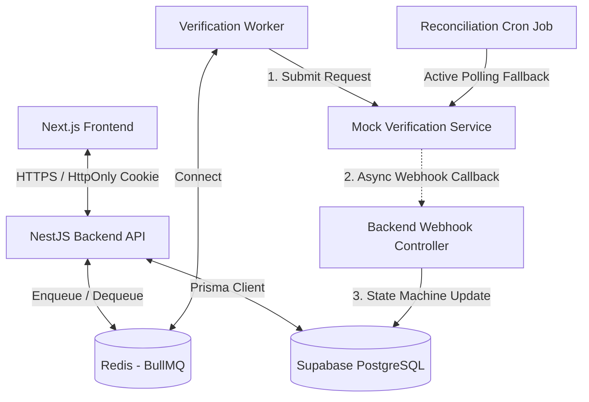

# Kivy Seller Verification Platform

A seller identity verification pipeline (Seller Identity Verification Pipeline) built with NestJS, Prisma, and Supabase (PostgreSQL). The system integrates a Message Queue (BullMQ) for rate limit control and high-load handling during the onboarding process.

---

## System Architecture

Below is the asynchronous operation diagram of the application:



- **Next.js Frontend:** User interface (Seller Dashboard / Admin Console).
- **NestJS Backend:** Acts as the API Gateway and handles all business logic.
- **Redis & BullMQ:** Message Queue controlling the frequency (Rate limit) of document submissions to external services.
- **Verification Worker:** Listens to the queue to send verification requests to the Mock service.
- **Mock Verification Service:** Runs independently, simulates the verification process, and returns results asynchronously.
- **Reconciliation Cron:** Active reconciliation mechanism in case webhook packets are lost.

---

## Production URLs

- **Frontend Web App:** [https://kivy-homework.vercel.app/](https://kivy-homework.vercel.app/)
- **Backend REST API:** [https://kivy-backend.onrender.com](https://kivy-backend.onrender.com) (Swagger API Docs: [https://kivy-backend.onrender.com/docs](https://kivy-backend.onrender.com/docs))
- **Mock Verification Service:** [https://kivy-mock-service.onrender.com/](https://kivy-mock-service.onrender.com/)

---

## Seeded Credentials

The database has been pre-seeded with the following test accounts for evaluation purposes:

| Role     | Email             | Password       | Test Functionality                                               |
| :------- | :---------------- | :------------- | :--------------------------------------------------------------- |
| **Seller** | `seller@kivy.com` | `sellerpassword` | Upload verification documents, view status, manage products.     |
| **Admin**  | `admin@kivy.com`  | `adminpassword` | View verification profiles list, moderate `INCONCLUSIVE` profiles. |

> [!TIP]
> **Quick Login (Auto-fill):** Both Admin and Seller login screens have a built-in **"Click to auto-fill"** feature right below the form. Simply click on the demo info fields and the system will automatically fill in the credentials without manual entry.

---

## Scope of Completion

### What Works

1. **Authentication & Authorization:** Uses JWT stored securely in **HttpOnly cookies**, with clear role separation between Admin and Seller.
2. **Seller Pipeline:** Uploads documents as Base64, automatically queues them for moderation, creates and displays product lists.
3. **Rate-Limited Queue:** Integrated **BullMQ + Redis** to ensure the request sending rate to third parties does not exceed the limit (Worker runs stably at ~80 req/minute).
4. **State Machine:** Implements a strict State Machine controlling status transitions (`PENDING` -> `PROCESSING` -> `VERIFIED` / `REJECTED` / `INCONCLUSIVE` -> `APPROVED` / `REJECTED`). Includes pessimistic locking (Row Locking) to prevent Race Conditions when duplicate webhooks arrive.
5. **Reconciliation (Active Reconciliation):** Cron job scans every 10 minutes, actively queries the third-party API for records stuck in `PROCESSING` status.
6. **Admin Dashboard:** Next.js interface displaying metrics charts, profile list filtered by status, intuitive document viewer, timeline recording event history and profile approval actions.
7. **Mock Service:** An independent Hono service simulating a third-party API with rate limit mechanisms (100 req/min), returning verification results asynchronously via Webhook or allowing polling for reconciliation.

### Deliberately Cut / Partial

1. **AWS S3 Storage:** To optimize development time, seller documents are currently stored directly as Base64 in the local database or written to local disk instead of being pushed to an actual cloud S3 service.
2. **Real-time Notifications (WebSockets):** Verification status on the frontend is currently updated via a simple Refresh mechanism instead of WebSocket or Server-Sent Events (SSE).

---

## Quick Start

The project consists of **3 components** that need to be started in order: Database → Mock Service → Backend → Frontend.

### Prerequisites

- **Node.js** v20 or higher
- **pnpm** v9+ (or npm/yarn)
- **Docker** and Docker Compose (to run Supabase local)
- **Redis** (already configured in `REDIS_URL` in `.env`)

---

### Step 1: Initialize Database (Supabase Local)

```bash
cd backend
pnpm install
pnpm run db:setup
```

This command will:

- Start Docker Supabase local
- Automatically run `prisma migrate dev` to create tables
- Generate Prisma Client

> **Note:** The `.env` file already exists with `DATABASE_URL` pointing to Supabase local. If missing, copy from `.env.example`.

---

### Step 2: Start Mock Service

```bash
# Open a new terminal
cd mock-service
pnpm install
pnpm run dev
```

- Mock Service runs on **port 3001**
- Simulates a third-party API with rate limit of 100 req/min
- Returns verification results via Webhook or polling

---

### Step 3: Start Backend (NestJS)

```bash
# Open a new terminal
cd backend
pnpm run start:dev
```

- Backend runs on **port 5000**
- Automatically connects to Redis via `REDIS_URL` in `.env`
- BullMQ worker processes the verification queue

---

### Step 4: Start Frontend (Next.js)

```bash
# Open a new terminal
cd frontend
pnpm install
pnpm run dev
```

- Frontend runs on **port 3000**
- Connects to backend at `http://localhost:5000`

---

### Verification

After successful startup:

| Service       | URL                              |
| ------------- | -------------------------------- |
| Frontend      | <http://localhost:3000>          |
| Backend API   | <http://localhost:5000>          |
| Mock Service  | <http://localhost:3001>          |
| Swagger Docs  | <http://localhost:5000/api/docs> |
| Prisma Studio | `pnpm run db:studio` (port 5555) |

**Test accounts:**

- Seller: `seller@kivy.com` / `sellerpassword`
- Admin: `admin@kivy.com` / `adminpassword`

---

## Database & Prisma CLI Commands

| Command (`pnpm run <name>`) | Description                                                                                           |
| :--------------------------- | :---------------------------------------------------------------------------------------------------- |
| `start:dev`                  | Starts NestJS server, automatically runs `prisma migrate dev` first to update local DB.                |
| `db:setup`                   | Quick setup command: starts Docker Supabase local and runs migrate to create tables.                   |
| `db:migrate`                 | Compares schema files, generates new SQL migration file and updates DB configuration.                  |
| `db:deploy`                  | **For Production/CI-CD**. Automatically overrides with `DIRECT_URL` to run migration via PgBouncer.    |
| `db:studio`                  | Opens Prisma Studio web-based data management UI at `http://localhost:5555`.                           |
| `db:generate`                | Manually regenerates Prisma Client after schema updates.                                               |

---

## Deployment Guide

### On Render

When creating a **Web Service** on Render, configure the following:

- **Root Directory**: `backend`
- **Build Command**: `pnpm install && pnpm run build`
- **Start Command**: `pnpm run db:deploy && pnpm run start:prod`
- **Environment Variables**: Declare the following 2 environment variables:
  - `DATABASE_URL`: Configure Pooling port `6543` with `?pgbouncer=true` parameter (for application connection).
  - `DIRECT_URL`: Configure direct connection port `5432` of Supabase (required to run migration without hanging).